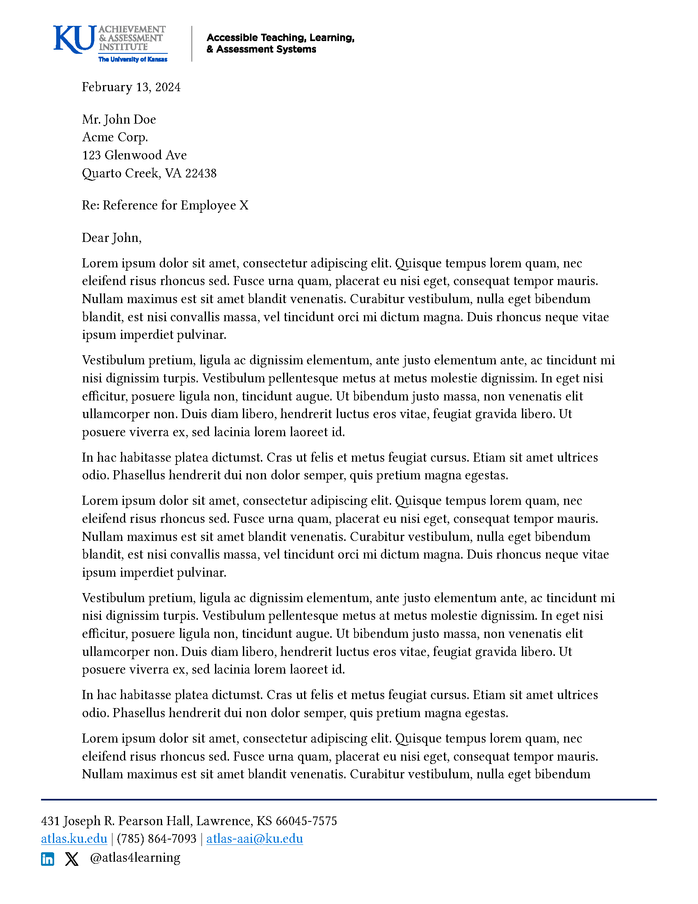

# KU Letter Format

Based on the KU letterhead format for Accessible Teaching, Learning, and Assessment Systems.

**NOTE**: This format requires the pre-release version of Quarto v1.4, which you can download here: <https://quarto.org/docs/download/prerelease>.

## Installing

```bash
quarto use template wjakethompson/wjt-quarto-ext/ku-letter
```

This will install the format extension and create an example qmd file that you can use as a starting place for your document.

## Using

The example qmd demonstrates the document options supported by the ku-letter format (subject, recipient, logos, etc.).
For example, your document options might look something like this:

```yaml
---
subject: "Reference for Employee X"
recipient: |
  Mr. John Doe \
  Acme Corp. \
  123 Glenwood Ave \
  Quarto Creek, VA 22438
sender: |
  W. Jake Thompson, Ph.D. \
  Assistant Director of Psychometrics \
  Accessible Teaching, Learning, and Assessment Systems \
  Achievement and Assessment Institute | University of Kansas \
  [jakethompson@ku.edu](mailto:jakethompson@ku.edu) | (785) 643-9244
header-logo: "atlas-horizontal.svg"
footer-logo: "atlas-vertical.svg"
date: today
date-format: "MMMM D, YYYY"
format:
  ku-letter-typst: default
---
```

KU letter documents are rendered as follows:



